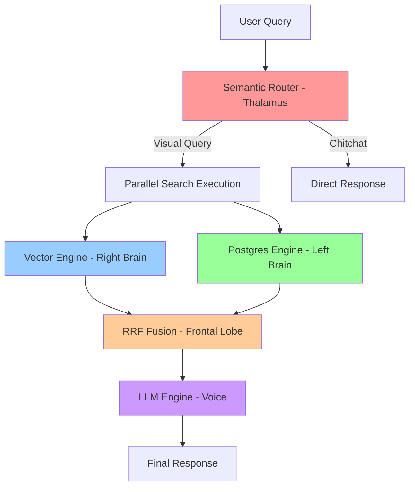
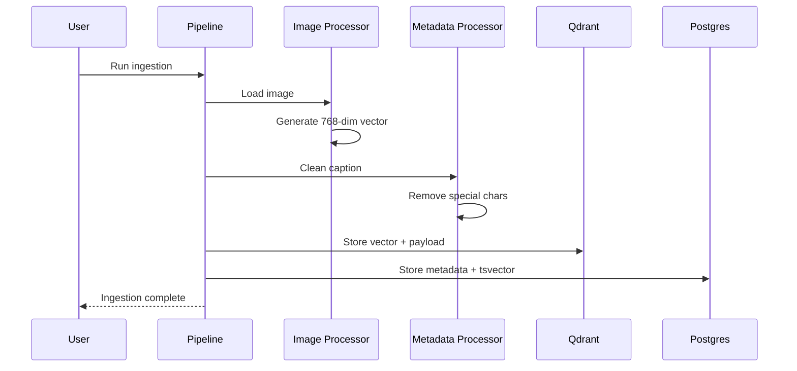
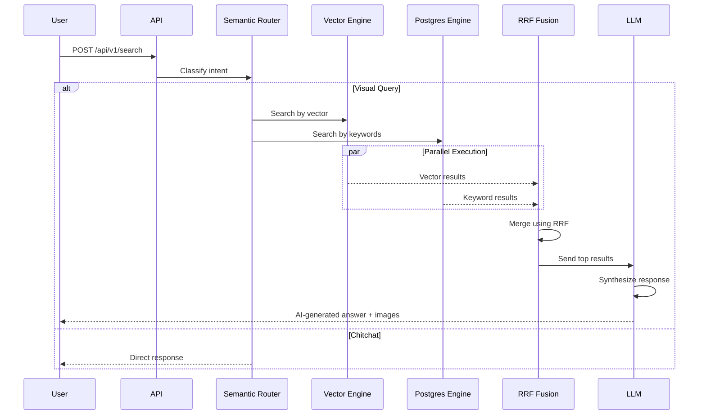

# ⚡ Agentic SpeedRAG: High-Performance Visual Search System

**Agentic SpeedRAG** is a cutting-edge retrieval system that implements a **"Retrieve-First, Reason-Later"** architecture, eliminating the traditional "Agentic Bottleneck" by executing searches in parallel, deterministic streams before involving high-level LLM reasoning.

This system combines **Vector Search (Semantic)** and **Keyword Search (Exact Match)** using a hybrid approach, powered by Qdrant, PostgreSQL, and SigLIP embeddings, with LLM-based response synthesis using Krutrim AI.

---

## 🎯 Key Features

- **⚡ Ultra-Fast Search**: Parallel execution of vector and keyword searches
- **🧠 Semantic Understanding**: SigLIP-based visual embeddings for "vibe" matching
- **🔍 Exact Matching**: PostgreSQL full-text search with GIN indexing
- **🎭 Intent Routing**: Automatic classification of queries (visual search vs. chitchat)
- **🤖 AI-Powered Responses**: LLM synthesis of search results using Krutrim
- **🔄 Hybrid Fusion**: Reciprocal Rank Fusion (RRF) for optimal result ranking
- **🐳 Docker-Ready**: Complete containerized setup for easy deployment

---

## 🏗️ System Architecture

### The Biological Analogy

The system is designed like a **biological reflex arc**, where different components act as specialized "organs":



### Component Breakdown

| Component | File | Role | Technology |
|-----------|------|------|------------|
| **Visual Cortex** | [`image_processor.py`](file:///c:/Users/raiha/OneDrive/Desktop/AgenticSpeedRAG/backend/ingestion/processors/image_processor.py) | Converts images to 768-dim vectors | SigLIP, PyTorch |
| **Auditory Cortex** | [`metadata_processor.py`](file:///c:/Users/raiha/OneDrive/Desktop/AgenticSpeedRAG/backend/ingestion/processors/metadata_processor.py) | Cleans text for keyword matching | Regex |
| **Orchestrator** | [`pipeline.py`](file:///c:/Users/raiha/OneDrive/Desktop/AgenticSpeedRAG/backend/ingestion/pipeline.py) | Manages data ingestion workflow | asyncpg, qdrant-client |
| **Thalamus** | [`semantic_router.py`](file:///c:/Users/raiha/OneDrive/Desktop/AgenticSpeedRAG/backend/app/services/semantic_router.py) | Routes queries by intent | NumPy, Vector Math |
| **Right Brain** | [`vector_engine.py`](file:///c:/Users/raiha/OneDrive/Desktop/AgenticSpeedRAG/backend/app/services/vector_engine.py) | Semantic similarity search | Qdrant, ONNX Runtime |
| **Left Brain** | [`postgres_engine.py`](file:///c:/Users/raiha/OneDrive/Desktop/AgenticSpeedRAG/backend/app/services/postgres_engine.py) | Exact keyword matching | PostgreSQL, GIN Index |
| **Frontal Lobe** | [`search.py`](file:///c:/Users/raiha/OneDrive/Desktop/AgenticSpeedRAG/backend/app/routers/search.py) | Merges results using RRF | asyncio |
| **Voice** | [`llm_engine.py`](file:///c:/Users/raiha/OneDrive/Desktop/AgenticSpeedRAG/backend/app/services/llm_engine.py) | Synthesizes natural responses | Krutrim API |

---

## 📂 Project Structure

```
AgenticSpeedRAG/
├── backend/
│   ├── ingestion/                    # PHASE 1: OFFLINE LEARNING
│   │   ├── pipeline.py               # Master orchestrator for data ingestion
│   │   ├── generate_anchors.py       # Creates semantic routing anchors
│   │   └── processors/
│   │       ├── image_processor.py    # SigLIP visual embeddings
│   │       └── metadata_processor.py # Text cleaning & normalization
│   │
│   ├── app/                          # PHASE 2: ONLINE REFLEX
│   │   ├── main.py                   # FastAPI application entry point
│   │   ├── config.py                 # Environment configuration
│   │   ├── routers/
│   │   │   ├── search.py             # Hybrid search endpoint
│   │   │   └── agent.py              # Agent-based interactions
│   │   └── services/
│   │       ├── semantic_router.py    # Intent classification
│   │       ├── vector_engine.py      # Qdrant vector search
│   │       ├── postgres_engine.py    # PostgreSQL keyword search
│   │       └── llm_engine.py         # Krutrim LLM integration
│   │
│   └── core/                         # Shared utilities
│
├── data/
│   └── raw_images/                   # Image storage directory
│
├── models/
│   └── anchors/                      # Pre-computed semantic anchors
│
├── docker-compose.yml                # Container orchestration
├── requirements.txt                  # Python dependencies
├── run_everything.ps1                # Windows startup script
└── .env                              # Environment variables
```

---

## 🚀 Quick Start

### Prerequisites

- **Python 3.9+**
- **Docker Desktop** (for Qdrant & PostgreSQL)
- **Git**

### Installation

#### 1. Clone the Repository

```bash
git clone https://github.com/Raihan2511/AgenticSpeedRAG.git
cd AgenticSpeedRAG
```

#### 2. Set Up Environment Variables

Create a `.env` file in the root directory:

```env
# Krutrim AI Configuration
KRUTRIM_API_KEY=your_api_key_here
KRUTRIM_BASE_URL=https://cloud.olakrutrim.com/v1
KRUTRIM_MODEL=Krutrim-spectre-v2
```

#### 3. Install Python Dependencies

```bash
pip install -r requirements.txt
```

#### 4. Start Docker Services

```bash
docker-compose up -d
```

This will start:
- **Qdrant** (Vector Database) on port `6333`
- **PostgreSQL** (Metadata Database) on port `5432`

#### 5. Generate Semantic Anchors

```bash
python -m backend.ingestion.generate_anchors
```

This creates pre-computed embeddings for intent classification in `models/anchors/`.

#### 6. Ingest Data

```bash
python -m backend.ingestion.pipeline
```

This will:
- Load images from `data/raw_images/`
- Generate SigLIP embeddings
- Store vectors in Qdrant
- Store metadata in PostgreSQL

#### 7. Start the API Server

```bash
python -m backend.app.main
```

The API will be available at `http://localhost:8000`

---

## 🔄 Complete Workflow

### Phase 1: Offline Learning (Data Ingestion)



**Steps:**

1. **Image Loading**: [`pipeline.py`](file:///c:/Users/raiha/OneDrive/Desktop/AgenticSpeedRAG/backend/ingestion/pipeline.py) scans `data/raw_images/` or processes URLs
2. **Vector Generation**: [`image_processor.py`](file:///c:/Users/raiha/OneDrive/Desktop/AgenticSpeedRAG/backend/ingestion/processors/image_processor.py) uses SigLIP to create embeddings
3. **Text Cleaning**: [`metadata_processor.py`](file:///c:/Users/raiha/OneDrive/Desktop/AgenticSpeedRAG/backend/ingestion/processors/metadata_processor.py) normalizes captions
4. **Dual Write**: Data is atomically written to both Qdrant (vectors) and PostgreSQL (metadata)

### Phase 2: Online Reflex (Search Execution)



**Steps:**

1. **Intent Classification**: [`semantic_router.py`](file:///c:/Users/raiha/OneDrive/Desktop/AgenticSpeedRAG/backend/app/services/semantic_router.py) determines if query is visual search or chitchat
2. **Parallel Search**: 
   - [`vector_engine.py`](file:///c:/Users/raiha/OneDrive/Desktop/AgenticSpeedRAG/backend/app/services/vector_engine.py) performs HNSW search in Qdrant
   - [`postgres_engine.py`](file:///c:/Users/raiha/OneDrive/Desktop/AgenticSpeedRAG/backend/app/services/postgres_engine.py) executes GIN-indexed full-text search
3. **Result Fusion**: [`search.py`](file:///c:/Users/raiha/OneDrive/Desktop/AgenticSpeedRAG/backend/app/routers/search.py) merges results using RRF algorithm
4. **Response Synthesis**: [`llm_engine.py`](file:///c:/Users/raiha/OneDrive/Desktop/AgenticSpeedRAG/backend/app/services/llm_engine.py) generates natural language response

---

## 🔧 API Documentation

### Health Check

```bash
GET /health
```

**Response:**
```json
{
  "status": "healthy",
  "database": "connected"
}
```

### Hybrid Search

```bash
POST /api/v1/search
Content-Type: application/json

{
  "query": "show me a picture of a python snake"
}
```

**Response (Visual Query):**
```json
{
  "intent": "visual_search",
  "context": [
    {
      "id": 0,
      "url": "http://localhost:8000/images/python_snake.jpg",
      "description": "A royal python snake coiled up on a branch",
      "filename": "python_snake.jpg"
    }
  ],
  "message": "I found an image of a royal python snake coiled up on a branch. Here's what I found: [Image URL]"
}
```

**Response (Chitchat):**
```json
{
  "intent": "chitchat",
  "context": [],
  "message": "Hello! I'm ready to help you find visual data. Try asking for a specific diagram or image."
}
```

---

## 🧪 Testing

### Test Search Functionality

Two test scripts are provided:

#### Test on Port 8000 (Default)

```bash
python test_search.py
```

#### Test on Port 8001

```bash
python test_search_8001.py
```

### Manual Testing with cURL

```bash
# Visual search query
curl -X POST http://localhost:8000/api/v1/search \
  -H "Content-Type: application/json" \
  -d '{"query": "find an image of a python logo"}'

# Chitchat query
curl -X POST http://localhost:8000/api/v1/search \
  -H "Content-Type: application/json" \
  -d '{"query": "hello, how are you?"}'
```

---

## 🧠 Technical Deep Dive

### 1. Vector Search (Semantic Similarity)

**Technology**: Qdrant + SigLIP + ONNX Runtime

**How it works**:
- Images are encoded into 768-dimensional vectors using SigLIP
- Vectors are stored in Qdrant with HNSW indexing
- Query text is encoded using the same model
- Cosine similarity finds semantically similar images

**Math**:
$$\text{Similarity} = \frac{\mathbf{q} \cdot \mathbf{v}}{||\mathbf{q}|| \cdot ||\mathbf{v}||} = \cos(\theta)$$

### 2. Keyword Search (Exact Matching)

**Technology**: PostgreSQL + GIN Index + tsvector

**How it works**:
- Text is tokenized and stemmed (e.g., "running" → "run")
- GIN index maps tokens to document IDs
- Full-text search uses `to_tsquery` for fast lookups

**SQL**:
```sql
SELECT id FROM image_metadata 
WHERE search_vector @@ to_tsquery('english', 'python & snake')
ORDER BY ts_rank(search_vector, to_tsquery('english', 'python & snake')) DESC
```

### 3. Reciprocal Rank Fusion (RRF)

**Formula**:
$$\text{Score}(d) = \sum_{r \in R} \frac{1}{k + \text{rank}_r(d)}$$

Where:
- $R$ = set of ranking functions (vector, keyword)
- $k$ = constant (default: 60)
- $\text{rank}_r(d)$ = rank of document $d$ in ranking $r$

**Why it works**: Prioritizes consensus between different ranking methods.

### 4. Semantic Routing

**Technology**: Pre-computed anchor vectors + Dot Product

**How it works**:
- Generate average embeddings for "visual search" and "chitchat" phrases
- Compare query vector to each anchor
- Route based on highest similarity

**Decision Rule**:
```python
if dot_product(query_vec, visual_anchor) > 0.45:
    return "visual_search"
else:
    return "chitchat"
```

---

## 🛠️ Configuration

### Environment Variables

| Variable | Description | Default |
|----------|-------------|---------|
| `KRUTRIM_API_KEY` | API key for Krutrim LLM | Required |
| `KRUTRIM_BASE_URL` | Base URL for Krutrim API | `https://cloud.olakrutrim.com/v1` |
| `KRUTRIM_MODEL` | Model name | `Krutrim-spectre-v2` |

### Docker Configuration

Edit [`docker-compose.yml`](file:///c:/Users/raiha/OneDrive/Desktop/AgenticSpeedRAG/docker-compose.yml) to customize:

- **Qdrant Memory Limit**: Default 4GB
- **PostgreSQL Credentials**: Default `admin:rootpassword`
- **Port Mappings**: Qdrant (6333), PostgreSQL (5432)

### Ingestion Configuration

Edit [`pipeline.py`](file:///c:/Users/raiha/OneDrive/Desktop/AgenticSpeedRAG/backend/ingestion/pipeline.py) to add custom data:

```python
curated_items = [
    {
        "path": "https://example.com/image.jpg",
        "text": "Description of the image"
    },
    {
        "path": "local_image.png",  # From data/raw_images/
        "text": "Custom description"
    }
]
```

---

## 🐛 Troubleshooting

### Issue: Docker containers not starting

**Solution**:
```bash
# Check Docker is running
docker ps

# Restart containers
docker-compose down
docker-compose up -d

# Check logs
docker-compose logs
```

### Issue: ModuleNotFoundError

**Solution**:
```bash
# Ensure you're in the project root
cd AgenticSpeedRAG

# Set PYTHONPATH
export PYTHONPATH=.  # Linux/Mac
$env:PYTHONPATH = "."  # Windows PowerShell

# Reinstall dependencies
pip install -r requirements.txt
```

### Issue: Qdrant connection refused

**Solution**:
```bash
# Verify Qdrant is running
curl http://localhost:6333/collections

# Check if port is in use
netstat -an | findstr 6333  # Windows
lsof -i :6333  # Linux/Mac
```

### Issue: PostgreSQL authentication failed

**Solution**:
- Verify credentials in [`docker-compose.yml`](file:///c:/Users/raiha/OneDrive/Desktop/AgenticSpeedRAG/docker-compose.yml) match those in [`pipeline.py`](file:///c:/Users/raiha/OneDrive/Desktop/AgenticSpeedRAG/backend/ingestion/pipeline.py)
- Default: `admin:rootpassword`

### Issue: LLM API errors

**Solution**:
- Verify `.env` file exists and contains valid `KRUTRIM_API_KEY`
- Check API endpoint: `https://cloud.olakrutrim.com/v1/chat/completions`
- Test API key manually:
```bash
curl -X POST https://cloud.olakrutrim.com/v1/chat/completions \
  -H "Authorization: Bearer YOUR_API_KEY" \
  -H "Content-Type: application/json" \
  -d '{"model": "Krutrim-spectre-v2", "messages": [{"role": "user", "content": "test"}]}'
```

---

## 📊 Performance Benchmarks

| Operation | Latency | Notes |
|-----------|---------|-------|
| Vector Search | ~50ms | HNSW with 10K vectors |
| Keyword Search | ~20ms | GIN index on 10K records |
| RRF Fusion | ~5ms | In-memory Python |
| LLM Synthesis | ~1-2s | Network-dependent |
| **Total E2E** | **~1.5-2s** | Including LLM |

---

## 🔐 Security Considerations

- **API Keys**: Never commit `.env` to version control
- **Database Credentials**: Change default passwords in production
- **CORS**: Configure allowed origins in [`main.py`](file:///c:/Users/raiha/OneDrive/Desktop/AgenticSpeedRAG/backend/app/main.py)
- **Rate Limiting**: Implement rate limiting for production deployments

---

## 🚀 Deployment

### Using Docker Compose (Recommended)

```bash
# Production build
docker-compose -f docker-compose.prod.yml up -d

# Scale API servers
docker-compose up -d --scale api=3
```

### Manual Deployment

1. **Set up databases** on cloud providers (Qdrant Cloud, AWS RDS)
2. **Update connection strings** in `.env`
3. **Deploy API** using Gunicorn:
```bash
gunicorn backend.app.main:app -w 4 -k uvicorn.workers.UvicornWorker
```

---

## 📚 Dependencies

### Core Libraries

- **FastAPI**: Web framework
- **Uvicorn**: ASGI server
- **Qdrant-client**: Vector database client
- **Transformers**: SigLIP model loading
- **PyTorch**: Deep learning framework
- **Pillow**: Image processing
- **NumPy**: Numerical operations
- **asyncpg**: Async PostgreSQL driver
- **ONNX Runtime**: Optimized inference

### Full List

See [`requirements.txt`](file:///c:/Users/raiha/OneDrive/Desktop/AgenticSpeedRAG/requirements.txt) for exact versions.

---

## 🤝 Contributing

1. Fork the repository
2. Create a feature branch (`git checkout -b feature/amazing-feature`)
3. Commit your changes (`git commit -m 'Add amazing feature'`)
4. Push to the branch (`git push origin feature/amazing-feature`)
5. Open a Pull Request

---

## 📝 License

This project is licensed under the MIT License.

---

## 🙏 Acknowledgments

- **SigLIP**: Google's Sigmoid Loss for Language-Image Pre-training
- **Qdrant**: High-performance vector database
- **Krutrim AI**: LLM API provider
- **FastAPI**: Modern Python web framework

---

## 📧 Contact

For questions or support, please open an issue on GitHub.

---

## 🎯 Roadmap

- [ ] Add support for video embeddings
- [ ] Implement multi-modal search (text + image queries)
- [ ] Add caching layer for frequent queries
- [ ] Build web UI for visual search
- [ ] Add support for multiple LLM providers
- [ ] Implement user authentication
- [ ] Add analytics dashboard

---

**Built with ❤️ for blazing-fast visual search**
